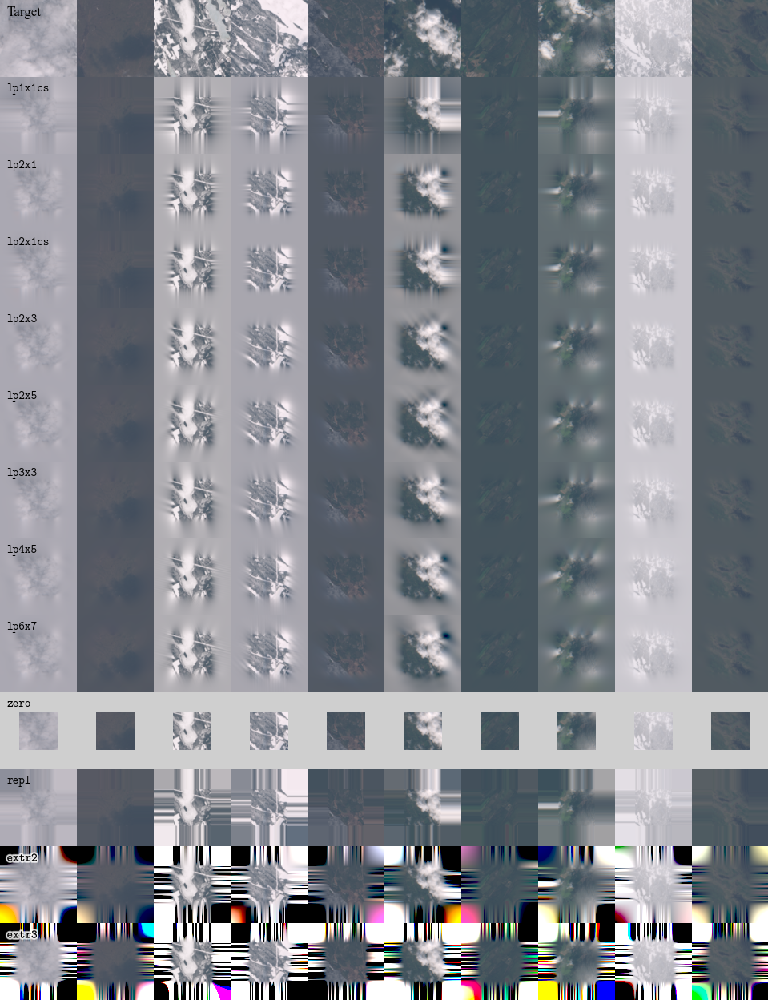

# Linear prediction padding
This is the repository for the paper "Depth-wise auto-regressive linear prediction padding in tiled CNN processing of 2D spatial data" (preprint to be published shortly).



## Using linear prediction padding

`padding.py` has a functional JAX implementation of linear prediction padding. Import `padding` and use the function `padding.linear_prediction_pad` specifying the padding with a tuple `padding=((top, bottom), (left, right))`. With default arguments the function implements the `lp2x3` method. For the `lp1x1` method use arguments `length=1, width=1, apodization=None, correlate_method="cov_stab"`. For the `lp2x1` method use arguments `length=2, width=1, apodization=None, correlate_method="cov_stab"`. For multi-channel data, `vmap` the function over channels. The option `correlate_method="cov_sym_stab"`, not mentioned in the paper, assumes a symmetric autoregressive process invariant to a 180 degree rotation.

If you have written your network as an Equinox module, then you may want to use the configurable `padding.Padding2dLayer` module to easily switch between different padding methods.

### Prerequisites

The following pip packages are needed:

```
numpy
jax
equinox
lineax
scipy
sympy
typing
```

## Reproducing the article's results
This section is for fully replicating the article's results from scarch, including dataset download, preprocessing, training, and evaluation.

### Prerequisites
An NVIDIA GPU with CUDA >=12 is needed. In practice, multiple GPUs are needed for full training. 16 GB GPU memory is enough. We have not tested with less GPU memory.

The command `python` should launch Python 3, for example Python 3.12.1.

The following pip packages are needed (for JAX, [check which version you need](https://docs.jax.dev/en/latest/installation.html) for your system to enable CUDA):
```
numpy
jax[cuda12]
optax
equinox
pillow
xarray
einops
lineax
sympy
requests
netcdf4
pyarrow
matplotlib
notebook
```

If you are on a Linux system, then for recreating the figures from the paper you will also need to install the Times New Roman font (you may need to restart any open Jupyter notebooks):

```shell
sudo apt-get install ttf-mscorefonts-installer
rm ~/.cache/matplotlib -rf
```

### Steps
To reproduce the paper's results:
* **Configure your local directories for data and result files**. Edit `paths_config.py`. If you move data files to different directories between workflow steps, reconfigure.
* **Download the 10k satellite image dataset**: This will download the dataset as zip files, extract them, and delete the zip files after exctraction.
  ```shell
  python download_dataset.py
  ```
* **Convert the dataset to train and test npy files**: This will also delete the dataset .nc files.
  ```shell
  python make_dataset_npys.py
  ```

If you want to do training, which is optional because the [hamk-uas/linear-prediction-padding-paper-models](https://github.com/hamk-uas/linear-prediction-padding-paper-models) repository includes trained models:

* **Test model training**: Choose one of the presets from `presets` dict from `job.py`, for example `lp1x1cs`, choose a seed, for example `42`, and train:
  ```shell
  python job.py preset=lp1x1cs seed=42
  ```
  Previous training runs are protected from overwriting. To redo training, use the command-line option `protect_existing=False` or manually delete the folder for the training run. If external causes interrupt the training before the last step `1_500_000`, resume the last valid checkpoint by:
  ```shell
  python job.py preset=lp1x1cs seed=42 resume_checkpoint=-1
  ```
* **Run training for all preset-seed pairs**: Seeds should run from `0` to `11` inclusive. It is also possible to use a subset of presets and consecutive seeds starting from `0`. It is not feasible to do all of the training on a single CPU and GPU in reasonable time. We recommend to use multiple CPUs and GPUs in parallel, reserving for each training run a full GPU and 80 GB of CPU memory (64 GB may work, but we haven't tested).
* **Extract and export trained model weights from the final checkpoints, and export loss histories**: This step was introduced to resolve module version incompatibilities between training and evaluation. The original training run data and checkpoints will NOT be deleted or altered by this step, and the rest of the steps will run on the exported models and histories.
  ```shell
  python export_trained_models.py
  ```

Continuing with the trained models:

* **Evaluate MSE of trained models on test images using different output crops**: The evaluation can be interrupted and resumed by running the script again.
  ```shell
  python eval_mse.py
  ```
* **Evaluate training time**: The evaluation can be interrupted and resumed by running the script again. When too large a batch size is attempted in the binary search, there will be warnings and errors, which is normal and harmless.
  ```shell
  python eval_train_time.py
  ```
* **Evaluate inference time**: The evaluation can be interrupted and resumed by running the script again. When too large a batch size is attempted in the binary search, there will be warnings and errors, which is normal and harmless.
  ```shell
  python eval_inference_time.py
  ```
* **Evaluate feature map padding-prediction NMSE of trained models using test images**
  ```shell
  python eval_layer_nmse.py
  ```
* **Reproduce figures**
  Run the notebook `make_figures_and_tables.ipynb`.

That's the most important bits. There's more:
* **Verify implicit repl padding in bilinear upscale**:
  ```shell
  python bilinear_test.py
  ```

## Acknowledgements

The work was supported by the Research Council of Finland funding decision 353076, Digital solutions to foster climate-smart
agricultural transition (Digi4CSA). Model training was done on the CSC – IT Center for Science, Finland supercomputer Puhti.
Sample images contain Copernicus Sentinel data 2015–2022.
